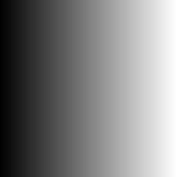
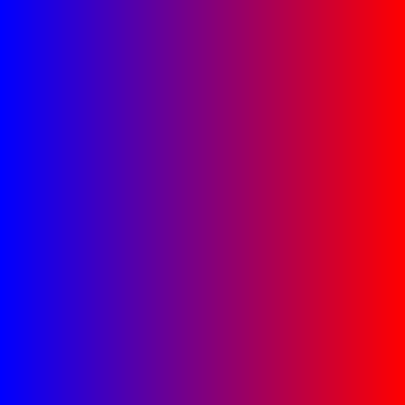
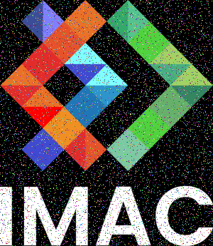
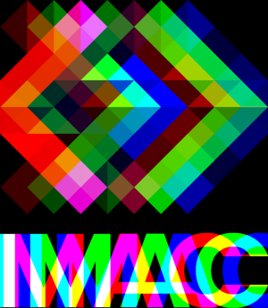
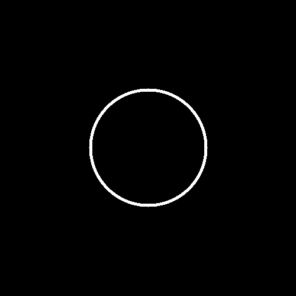
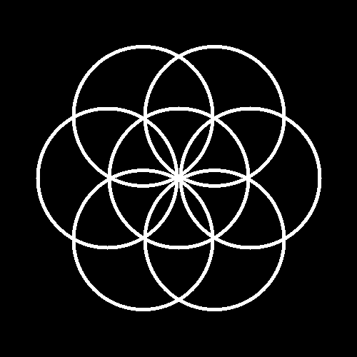

# Workshop Programmation & Algorithmique – Traitement d’images

Ce workshop de programmation en C++ utilise la librairie **SIL** pour manipuler des images pixel par pixel.  
L’objectif est de découvrir les bases du **traitement d’image algorithmique** : modification de couleurs, filtres, transformations géométriques et génération d’images.

## Mettre en vert

**Description :**  
Supprime les composantes rouge et bleue de l’image pour ne conserver que le vert.

**Avant :**  

**Après :**  

## Échanger rouge et bleu

**Description :**  
Inverse les canaux rouge et bleu de chaque pixel.

**Avant :**  

**Après :**  

## Noir et blanc

**Description :**  
Convertit l’image en niveaux de gris à partir d’une moyenne pondérée des couleurs.

**Avant :**  

**Après :**  

## Négatif

**Description :**  
Inverse les couleurs de l’image (effet négatif).

**Avant :**  

**Après :**  

## Dégradé horizontal (gris)

**Description :**  
Crée une image avec un dégradé horizontal du noir vers le blanc.

**Création :**  

## Dégradé de couleur

**Description :**  
Crée un dégradé horizontal allant du bleu vers le rouge.

**Création :**  

## Miroir horizontal

**Description :**  
Retourne l’image horizontalement.

**Avant :**  

**Après :**  

## Bruit aléatoire

**Description :**  
Ajoute du bruit aléatoire sur certains pixels de l’image.

**Avant :**  

**Après :**  

## Rotation 90° à droite

**Description :**  
Fait pivoter l’image de 90 degrés dans le sens horaire.

**Avant :**  

**Après :**  

## Décalage RGB

**Description :**  
Décale les canaux rouge et bleu horizontalement pour créer un effet chromatique.

**Avant :**  

**Après :**  

## Cercle plein

**Description :**  
Dessine un cercle blanc plein au centre d’une image noire.

**Création :**  

## Cercle avec contour

**Description :**  
Dessine uniquement le contour d’un cercle avec une épaisseur donnée.

**Création :**  

## Animation d’un cercle

**Description :**  
Génère une animation où un cercle se déplace de gauche à droite sur plusieurs frames.

**Création :**  
Les images sont sauvegardées sous la forme `frame_000.png` à `frame_059.png`.

## Rosace à 6 cercles

**Description :**  
Dessine une rosace composée de 6 cercles autour d’un cercle central.

**Création :**  

## Mosaïque simple

**Description :**  
Répète l’image source pour remplir une image plus grande.

**Avant :**  

**Après :**  

## Mosaïque miroir

**Description :**  
Crée une mosaïque en alternant des images retournées horizontalement et verticalement.

**Avant :**  

**Après :**  

## Glitch

**Description :**  
Échange aléatoirement des rectangles de pixels pour créer un effet glitch.

**Avant :**  

**Après :**  

## Conclusion

Ce workshop m’a permis de comprendre :
- la manipulation d’images pixel par pixel
- l’utilisation de boucles et de mathématiques simples en traitement d’image
- la génération d’images et d’animations